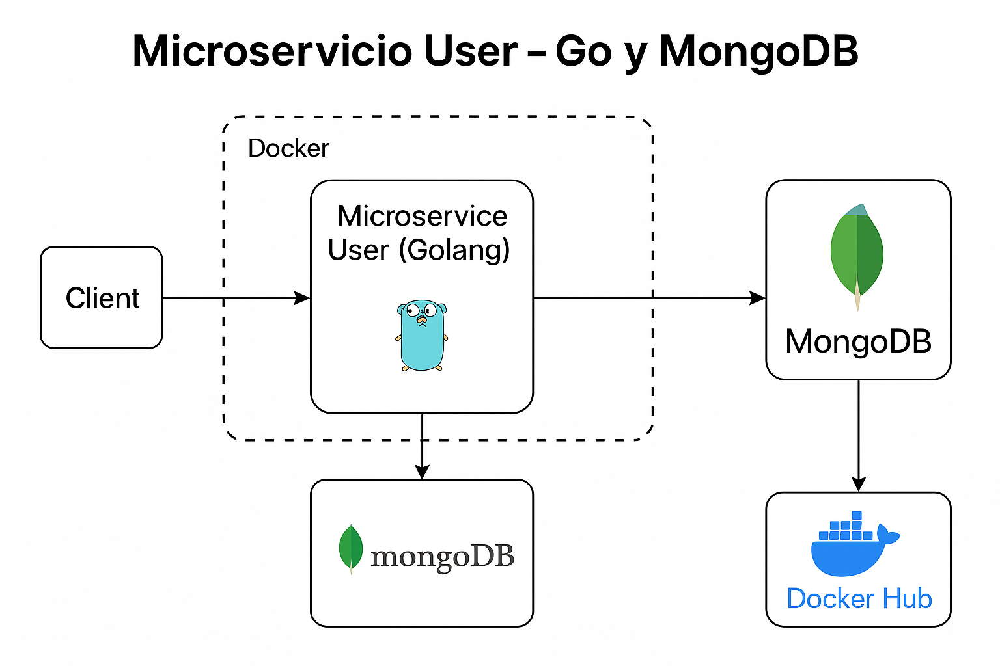

# 🧠 Microservicio de Usuarios en Go + MongoDB

Este proyecto implementa un **microservicio RESTful en Golang** que permite realizar operaciones CRUD sobre la entidad `User`, utilizando **MongoDB como base de datos**, y completamente contenerizado usando **Docker** y **Docker Compose**.

---

## 🚀 Tecnologías Usadas

- 🐹 Golang 1.22
- 🍃 MongoDB (Dockerizado)
- 🐳 Docker y Docker Compose
- ✅ Testify para pruebas unitarias
- ⚡ Thunder Client (VSCode)
- 📊 Reporte de cobertura de código
- 🛠 Script de automatización en Bash

---

## 📁 Estructura del Proyecto

```
microservicio-golang-mongodb/
├── config/                 # Configuración (MongoDB, .env)
├── controllers/            # Endpoints HTTP
├── services/               # Lógica de negocio
├── repositories/           # Acceso a MongoDB
├── models/                 # Entidad User
├── routes/                 # Enrutamiento
├── tests/                  # Pruebas unitarias
├── thunder/                # Colección Thunder Client exportada
├── Dockerfile              # Docker multi-stage build
├── docker-compose.yml      # Orquestación con Docker Compose
├── run.sh                  # Script de automatización
├── .env                    # Variables de entorno (ignorado en Git)
├── README.md               # Este README glorioso
```

---

## 🧪 Cómo Ejecutar

### 🔧 Opción 1: Local (requiere MongoDB instalado)

```bash
go run main.go
```

### 🐳 Opción 2: Docker Compose (recomendado)

```bash
docker compose up --build
```

### 🚀 Opción 3: Script de automatización (con bonus)

```bash
./run.sh
```

---

## 🔁 Endpoints CRUD

| Método | Ruta             | Descripción             |
|--------|------------------|--------------------------|
| POST   | `/users`         | Crear un nuevo usuario   |
| GET    | `/users`         | Obtener todos los usuarios |
| GET    | `/users/:id`     | Obtener usuario por ID   |
| PUT    | `/users/:id`     | Actualizar usuario       |
| DELETE | `/users/:id`     | Eliminar usuario         |

---

## ✅ Pruebas y Cobertura

```bash
go test ./tests -v
go test -cover ./...
go test -coverprofile=coverage.out ./...
go tool cover -html=coverage.out
```

---

## ⚡ Thunder Client

Colección completa exportada:  
📁 `thunder/user-api.json`

Incluye pruebas para todos los endpoints.

---

## 🐳 Imagen en Docker Hub

📦 Publicada en Docker Hub:  
👉 https://hub.docker.com/r/samuel05x/microservicio-user

---

## 🛠 Script de Automatización

```bash
./run.sh
```

Hace:
1. `docker compose down`
2. `docker compose build`
3. `docker compose up -d`

Todo en un solo paso.

---

## 👨‍🏫 Autor y Entorno Académico

- **Autor:** Samuel Sogamoso Osorio  
- **Materia:** Sistemas Operativos  
- **Parcial:** 2do Parcial  
- **Facultad:** Ingeniería  
- **Año:** 2025

---

## 🏆 Estado del Proyecto

| Característica                         | Estado |
|----------------------------------------|--------|
| CRUD funcional y probado               | ✅     |
| Arquitectura modular                   | ✅     |
| MongoDB contenerizado con volumen      | ✅     |
| Dockerfile optimizado (multi-stage)    | ✅     |
| docker-compose.yml funcional           | ✅     |
| Pruebas con Testify                    | ✅     |
| Cobertura de código                    | ✅     |
| Colección Thunder Client exportada     | ✅     |
| Imagen publicada en Docker Hub         | ✅     |
| Script Bash de automatización (BONUS) | ✅     |

---

## 🧩 Diagrama de Infraestructura




> ✨ ¡Este microservicio está tan bien hecho que hasta Mongo quiere documentarse solo! ✨

